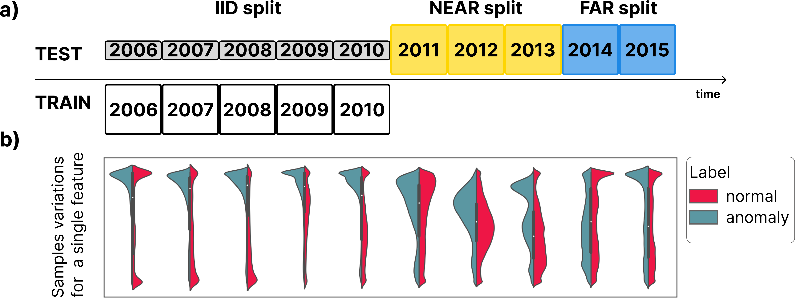

# AnoShift

- **Title**: AnoShift: A Distribution Shift Benchmark for Unsupervised Anomaly Detection
- **Authors**: Marius Dragoi, Elena Burceanu, Emanuela Haller, Andrei Manolache, Florin Brad
- **[ArXiv Preprint](https://arxiv.org/abs/2206.15476)**

## AnoShift Protocol

- We introduce an unsupervised anomaly detection benchmark with data that shifts over time, built over Kyoto-2006+, a traffic dataset for network intrusion detection. This type of data meets the premise of shifting the input distribution: it covers a large time span (from 2006 to 2015), with naturally occurring changes over time. In AnoShift, we split the data in **IID**, **NEAR**, and **FAR** testing splits. We validate the performance degradation over time with diverse models (MLM to classical Isolation Forest).



- With all tested baselines, we notice a significant decrease in performance on **FAR** years for inliers, showing that there might be a particularity with those years. We observe a large distance in the Jeffreys divergence on **FAR** and the rest of the years for 2 features: service type and the number of bytes sent by the source IP.

- From the OTDD analysis we observe that: first, the inliers from **FAR** are very distanced to training years; and second, the outliers from **FAR** are quite close to the training inliers.

- We propose a BERT model for MLM and compare several training regimes: **iid**, **finetune** and a basic **distillation** technique, and show that acknowledging the distribution shift leads to better test performance on average.

## Kyoto-2006+ data

- Original Kyoto-2006+ data available at: https://www.takakura.com/Kyoto_data/ (in AnoShift we used the New data (Nov. 01, 2006 - Dec. 31, 2015))

- Preprocessed Kyoto-2006+ data available at: https://share.bitdefender.com/s/9D4bBE7H8XTdYDB

- The result is obtained by applying the preprocessing script `data_processor/parse_kyoto_logbins.py` to the original data.

- The preprocessed dataset is available in pandas parquet format and available as both [full sets](https://share.bitdefender.com/s/9D4bBE7H8XTdYDB?path=%2Ffull) and [subsets](https://share.bitdefender.com/s/9D4bBE7H8XTdYDB?path=%2Fsubset) with 300k inlier samples, with equal outlier proportions to the original data.

- In the notebook tutorials, we use the subsets for fast experimentation. In our experiments, the subset results are consistent with the full sets.

* Label column (18) has value 1 for inlier class (normal traffic) and -1 (known type) and -2 (unknown type) for anomalies.

## Prepare data

```
curl https://share.bitdefender.com/s/9D4bBE7H8XTdYDB/download --output AnoShift.zip

mkdir datasets

mv AnoShift.zip datasets

unzip datasets/AnoShift.zip -d datasets/

rm datasets/AnoShift.zip
```

## Prepare environment
* Create a new conda environment: `conda create --name anoshift`
* Activate the new environment: `conda activate anoshift`
* Install pip: `conda install -c anaconda pip`
* Upgrade pip: `pip install --upgrade pip`
* Install dependencies: `pip install -r requirements.txt`


## Notebooks

There are several notebooks in the `notebooks/` directory which are a good entrypoint of familiarization with the protocol:

- `train_kyoto_bert`: trains an IID BERT model on a Kyoto-2006+ subset, then compares the finetune and distillation training regimes from the IID checkpoint on the next subset
- `eval_kyoto_bert`: loads a Kyoto-2006+ subset, a pretrained tokenizer and pretrained BERT model and evaluates on subset
- `baselines_kyoto_isoforest`: isoforest baseline on Kyoto-2006+
* run the notebooks from the `root` of the project: `jupyter-notebook .`

## Please cite this project as:

```
@article{druagoi2022anoshift,
  title={AnoShift: A Distribution Shift Benchmark for Unsupervised Anomaly Detection},
  author={Dr{\u{a}}goi, Marius and Burceanu, Elena and Haller, Emanuela and Manolache, Andrei and Brad, Florin},
  journal={arXiv preprint arXiv:2206.15476},
  year={2022}
}
```
